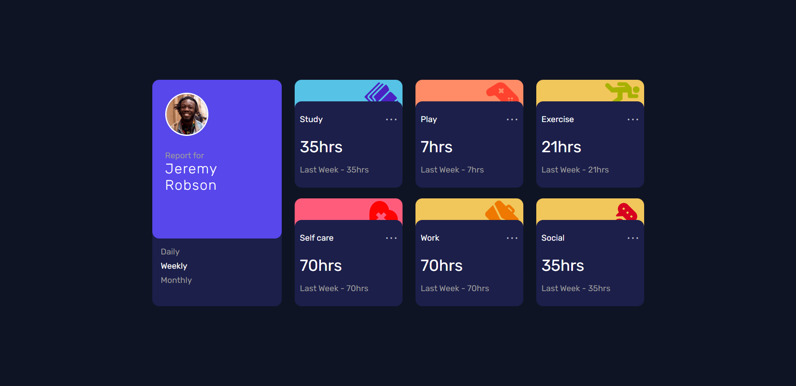

<h1 align="center"> E-commerce app 💻 </h1>

## Briefing 📄

A e-commerce app built in angular. The data is stored with localforage, the product
images and details are provided by fakerJs and checkout simulation by stripe in test mode.

> [Acessar]()

<h2 align="left"> Objetivo 📌 </h2>

- Improve angular skills

---

<h3 align="center"> Home 📷 </h3>

<h3 align="center"> Tecnologias utilizadas 🤖 </h3>

 > 

 >   
 >   
 >   
 > 

